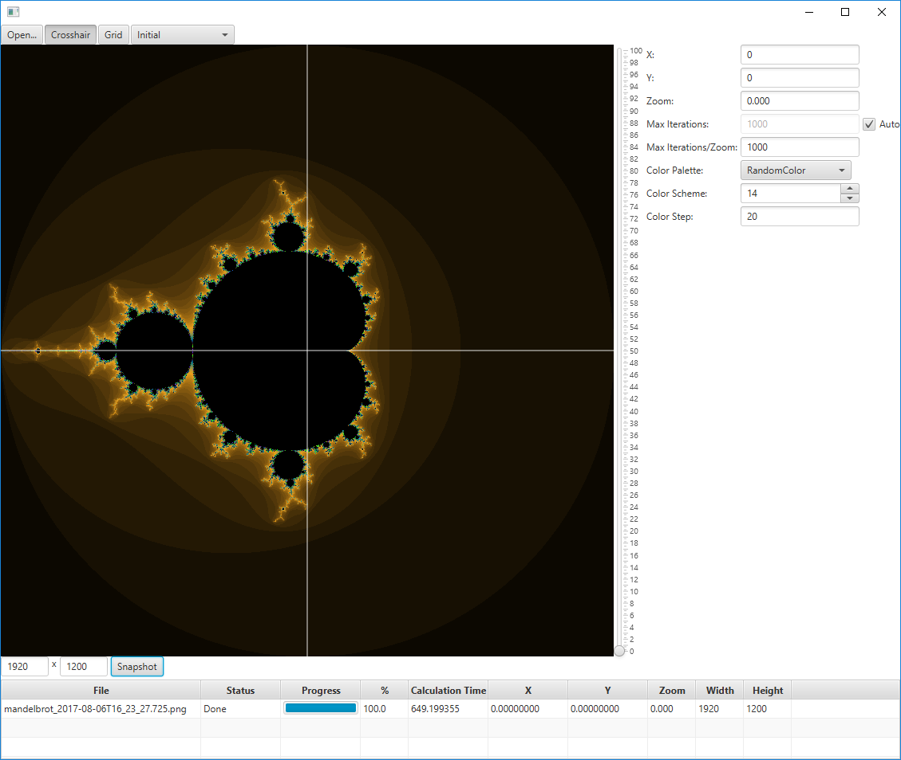

# mandelbrot

Interactive Mandelbrot Viewer and command line tools to generate zoom sequences into the Mandelbrot set.

## Interactive Mandelbrot Viewer

The interactive Mandelbrot Viewer allows user interaction using mouse, touch gestures or the keyboard.

It is possible to zoom interactively down to 10<sup>-100</sup> and beyond, all calculations switch automatically from double to BigDecimal if more precision is needed.

Rendering is progressive and optimized so that the application stays responsive, although the complete rendering of an image on zoom level 100 may surpass 1 hour.

The viewer allows to create snapshot image files which will be rendered in the background.

Multiple color palette variations are supported.

To start the interactive viewer use the following command line:
```bash
java -jar mandelbrot-viewer.1.0.1.jar
```

Depending on the settings in your OS you might get away with simply double clicking the distributed file ` mandelbrot-viewer.1.0.1.jar`.



## Command Line Tool `mandelbrot`

The command line tool `mandelbrot` allows to create images from the `*.mandelbrot` files created by the interactive Mandelbrot Viewer.

To install the tool you need to unzip the distribution file `mandelbrot-1.0.1.zip` and set the PATH environment variable to the `bin` directory.

```bash
mandelbrot --width 1920 --height 1200 *.mandelbrot
```

## Command Line Tool `mandelbrot-zoom`

The command line tool `mandelbrot-zoom` allows to automatically create many images for a specific point in the mandelbrot at increasing zoom levels.

The generated images can be used to create a video that zooms deeper and deeper into the specified point.

To install the tool you need to unzip the distribution file `mandelbrot-zoom-1.0.1.zip` and set the PATH environment variable to the `bin` directory.

You can simply specify to render a point of interest (that are also available in the interactive viewer):
```bash
mandelbrot-zoom --poi Thorns
```

You may also specify the complete rendering information (the example shows the same point as the "Thorns" example above:
```bash
mandelbrot-zoom \
    --x 0.615688188277165136862977361674265969958593022307313876044710397223212241218305144722407409388125158236774855883651489995471305785441350335740253105778 \
    --y  0.674900407359391397989165449336345186641209056492297641703764886106334430140801874852392546319746961769590518919533419668508561716801971179771345638618 \
    --zoomStart 5 \
    --zoomStep 0.1 \
    --paletteSeed 1 \
    --paletteStep 10 \
    --imageCount 100 \
    --directoryName Thorns
```
This will create a folder containing 100 images starting with a radius of 5, incrementing the zoom level by 0.1 every image.

You can create a video from these images using the `ffmpeg` tool:
```bash
ffmpeg -y -r 10 -start_number 0 -i mandelbrot%04d.png -s 800x800 -vcodec mpeg4 -q:v 1 mandelbrot.mp4
```

## Video Gallery 

[](https://www.youtube.com/watch?v=p3Zv8fSEsSg "Wheels on Fire")

## Gallery

A gallery of the best mandelbrot images is available in https://github.com/eobermuhlner/mandelbrot-gallery

## Palettes

The Mandelbrot viewer and Zoom application support different palette algorithms.

### Palette Random Colors


### Palette Random Gray


### Palette Random Pastell


### Palette Fire


### Palette Water


### Palette Earth


### Palette Air


### Palette Forest


### Palette Starry Night


### Palette Drawing


### Palette Rainbow


### Palette Log Random Color


### Palette Log Random Gray


## Development

The project can be built in the command line with gradle. To see a list of available gradle tasks execute:
```bash
./gradlew tasks
```

### Eclipse Development

After cloning the git repository you can either use the gradle command line to create the eclipse project files:
```bash
./gradlew eclipse
```
and import with "Existing Projects into Workspace".

or if you have the Gradle Buildship Plugin installed you simply import with "Gradle Project".
